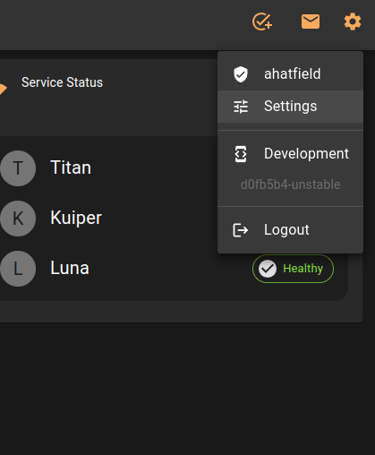
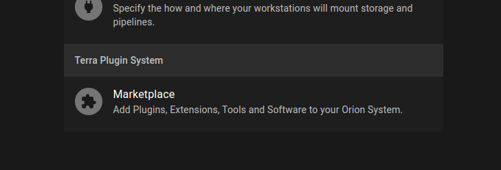
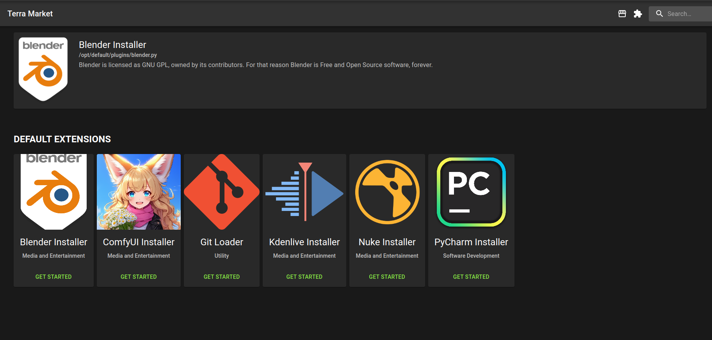
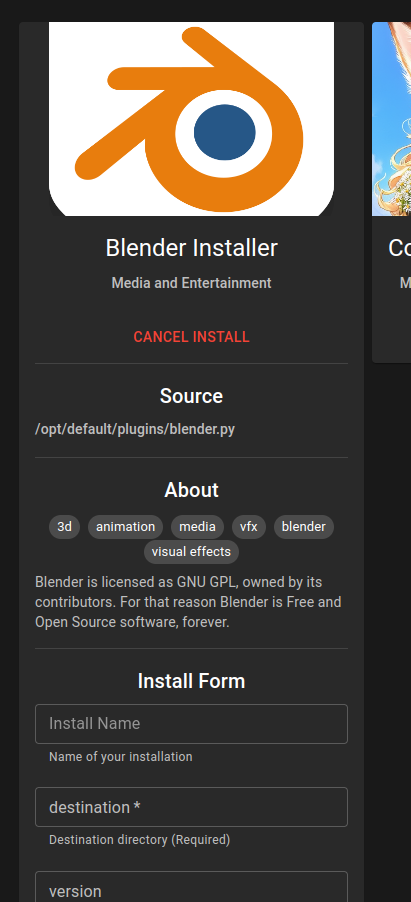
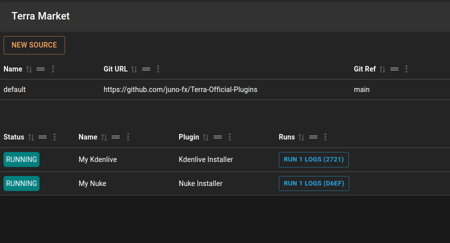

# 
Running A Terra Plugin

## Prerequisites

* A running Orion Cluster

## Accessing Terra

* To access Terra, you will need to access the Orion Cluster Settings.

* From there, you should see "Marketplace" at the bottom of the settings list.

* Click on "Marketplace" and you will be taken to the "Terra Marketplace".

## Install Blender

* Click the "Get Started" button under the Blender logo in the "Default Extensions" section of the Market.

* Fill out all the required fields and click "Install" at the bottom of the Plugin.

## Check Installation

You can check the install logs and progress by clicking the Puzzle Piece icon in the top right of the Market.
That will take you to the "Sources and Installed" page.

From here, you can check the state of your install, get logs and much more.

## Custom Sources

You can add additional sources to the Terra Marketplace by clicking the "New Source" button in the top left of the page.
As long as the repository follows the same structure as the Terra-Official-Plugins, you can add it to your Orion Cluster.
