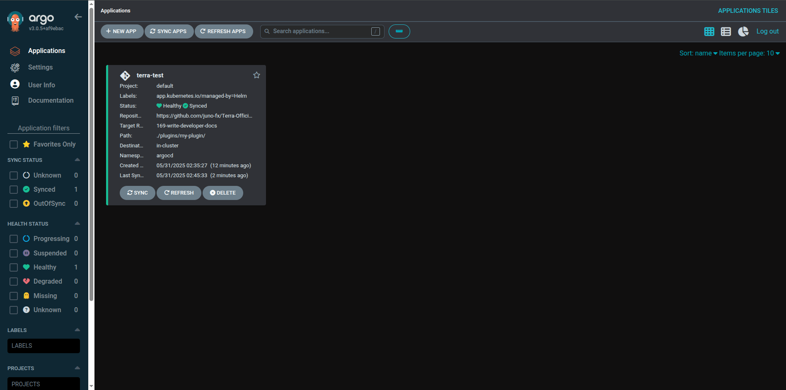
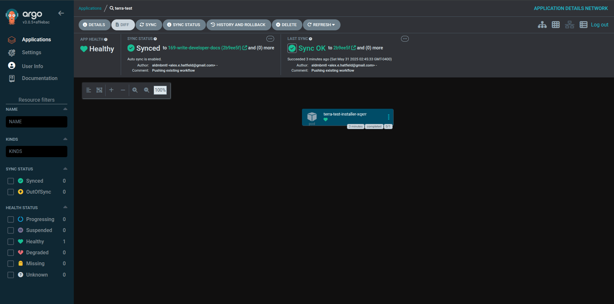

# Workflow

## Overview

The development workflow is designed to focus on the raw Helm Chart development and then simulate the deployment
via a local Kubernetes cluster installed with ArgoCD. This allows developers to iterate quickly on their plugins
locally without needing to deploy to a production environment until they are ready. The workflow is as follows:

1. Create the plugin locally and push it to a remote branch.
2. Launch a local Kind Cluster pre-installed with ArgoCD.
3. Install the ArgoCD Application Resource that points to your plugin on your remote branch.
4. Log in to the ArgoCD UI and see your plugin listed as an Application.
5. Make changes to your plugin locally and push them to the remote branch.
6. ArgoCD will automatically detect the changes and update the application in the local cluster.
7. If you are running a more complex Plugin that uses the `/scripts` directory, make sure to run `make package <plugin name>` to package your plugin before pushing changes. This will ensure that the scripts are included in the Helm Chart.
8. Repeat the process until you are satisfied with your plugin.

## Workflow Steps

1. **Create a Plugin**: Use the `make new-plugin <plugin name>` command to create a new plugin scaffolding.

    <!-- termynal -->

    ```shell
    $ make new-plugin my-plugin
    ```

2. **Push to Remote Branch**: Commit your changes and push them to a remote branch.
3. **Launch Local Cluster**: Use `make test <plugin name>` to start a local Kind cluster with ArgoCD pre-installed.

    <!-- termynal -->

    ```shell
    $ make test my-plugin
    ...
    >> ArgoCD UI Listening <<
    http://localhost:8080
   
    >> ArgoCD Admin Credentials <<
    admin
    336LYpUVgfDeFUKb
    ```

4. **Access ArgoCD UI**: Open the ArgoCD UI in your browser at `http://localhost:8080` and log in with the provided credentials.

    

    !!! danger "ArgoCD Sync Failure"
        If you encounter a sync failure that states something about "failed to dial", this is likely due to
        a race condition where the ArgoCD server is not fully up and running before the sync is attempted. Open the
        cluster and restart the ArgoCD server.

    !!! danger "ArgoCD Sync Failure"
        If your plugin says "path not found", you need to push your changes to the remote branch before running the
        `make test` command. ArgoCD needs to see the latest changes in the remote branch to sync correctly.

5. **Make Changes**: Make changes to your plugin locally and push them to the remote branch.

6. **Automatic Sync**: ArgoCD will automatically detect the changes and update the application in the local cluster.

    

    !!! info "Force Refresh"
        ArgoCD will automatically refresh the application every 3 minutes. If you want to force a refresh, you can click the "Refresh" button in the ArgoCD UI.

7. **Verify Changes**: You can verify the changes by checking the logs of the application or by accessing the application in the local cluster.

8. **Repeat**: Continue making changes and pushing them to the remote branch. ArgoCD will keep your local cluster in sync with the latest changes.

9. **Clean Up**: When you are done testing, you can clean up the local cluster by running:

    <!-- termynal -->

    ```shell
    $ make down
    ```
